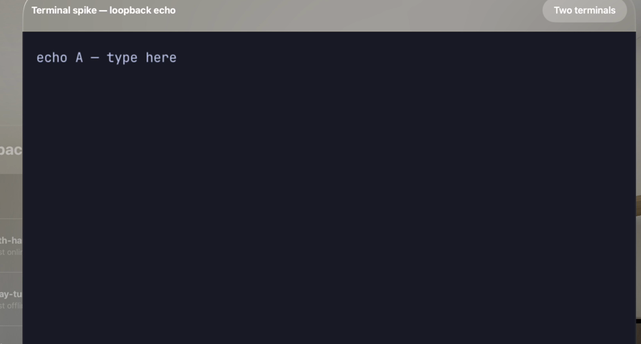

# Terminal Surface — Phase 1 Spike Report

**Branch:** `feat/terminal-surface` (off `vision-pro-app`)
**Date:** 2026-06-24
**Goal:** Prove the prebuilt `TerminalSurface` (libghostty) package renders and accepts input inside the Superset visionOS client behind a `LoopbackTerminalIO` echo transport — no real network transport.

## TL;DR — PASS

The integration is wired, **builds green for both `xrsimulator` and `xros`** with the terminal code warning-clean under Swift 6 strict concurrency, and **the terminal renders, echoes input, and two terminals coexist** on the visionOS Simulator. The earlier `EXC_BREAKPOINT` bring-up crash is **fixed** by the package update (ghostty-visionos#2, commit `122eefd`): libghostty's off-main `receive_buffer` / `receive_resize` callbacks now target a lock-guarded `Sendable` `TerminalOutputSink` instead of `MainActor.assumeIsolated`, so the `termio` IO thread no longer traps.

`TerminalSpikeUITests.testTerminalRendersEchoesAndCoexists` is **un-skipped and passing**.



*The libghostty surface painting the `LoopbackTerminalIO` banner (`echo A — type here`) — delivered through the exact `receive_buffer` path that previously crashed — with the "Two terminals" two-up toggle top-right.*

## The fix (package-side, no host change)

| Before (crashed) | After (`122eefd`, passing) |
| --- | --- |
| `attach(to:)` ran the C `receive_buffer` / `receive_resize` bodies inside `MainActor.assumeIsolated { … }`, assuming the callbacks fire on main. | The C callbacks target a separate `TerminalOutputSink` (`@unchecked Sendable`, `NSLock`-guarded). No `assumeIsolated`, no main hop. |
| With the `HOST_MANAGED` backend the engine drives the callback from its own `termio` thread → `dispatch_assert_queue` fails → `SIGTRAP`. | The single `termio` thread calls the sink serially, so byte order holds; handlers run outside the lock to avoid reentrancy. |

The libghostty xcframework/header are unchanged; the fix is entirely Swift-side in the package. The host uses `LoopbackTerminalIO`, so **no host change was needed for Phase 1**.

> **Phase 2 note (carry forward):** the package's delivery contract is now "IO-thread delivery" — `onWrite` / `onResize` handlers are invoked **off the main actor, serially on the termio thread**. The Phase 1 `LoopbackTerminalIO` is already safe under this. A future custom `TerminalIO` over the relay (Phase 2) **must be thread-safe**: its send/receive bridge will be called off-main and must not touch main-actor state without marshalling.

## Files changed

| File | Change |
| --- | --- |
| `apps/visionos/project.yml` | Top-level `packages:` with a `TerminalSurface` entry (path `/Users/sethgho/ghv-spike/TerminalSurface`); `dependencies:` on the `Superset` target (`package: TerminalSurface` / `product: TerminalSurface`). |
| `apps/visionos/Sources/SupersetApp.swift` | Added a `Terminal` `WindowGroup` scene keyed by `TerminalScene.windowID`, mirroring the existing scenes. Outside the lock gate (carries no relay credential). |
| `apps/visionos/Sources/UI/TerminalWindow.swift` | Defines `TerminalScene.windowID` and the `TerminalWindow` view: embeds `TerminalSurfaceView(controller:)`, attaches `LoopbackTerminalIO(banner:)` in `.onAppear` / detaches in `.onDisappear`, plus a two-up toggle that brings up a second independent controller to prove N>1. |
| `apps/visionos/Sources/UI/DebugDumpView.swift` | "Open Terminal Spike" button (`@Environment(\.openWindow)`) — the temporary entry point behind the Debug window. Not wired into the production rail. |
| `apps/visionos/UITests/TerminalSpikeUITests.swift` | Drives the real entry point (workspace list → Settings → Debug → Open Terminal Spike), types into the surface, toggles two-up. **`XCTSkipIf` removed; passing.** |
| `apps/visionos/Superset.xcodeproj/project.pbxproj` | Regenerated by `xcodegen generate`. |

## Build results

`xcodegen generate` in `apps/visionos/` succeeds.

| Target | SDK | Result |
| --- | --- | --- |
| `Superset` (scheme `Superset`) | `xrsimulator` (Apple Vision Pro, visionOS 26.4 SDK) | **BUILD SUCCEEDED**, terminal code warning-clean |
| `Superset` (scheme `Superset`) | `xros` (generic visionOS device) | **BUILD SUCCEEDED** (compiled with `CODE_SIGNING_ALLOWED=NO`; the empty `DEVELOPMENT_TEAM` is pre-existing project config, not an integration issue). |

Swift 6 strict concurrency (`-swift-version 6`) stays clean for all terminal-integration code (`TerminalWindow.swift`, `DebugDumpView.swift`, the package). Both SDK builds surface the same 3 pre-existing warnings in untouched app code (`Sources/Auth/AuthController.swift`, `Sources/Observability/DeviceContext.swift` — `UIDevice` main-actor isolation); `git diff` confirms those files were not touched by this spike.

## Simulator run result

Run via `TerminalSpikeUITests/testTerminalRendersEchoesAndCoexists` on the Apple Vision Pro Simulator (visionOS 26.4). **Test passed in ~20s. No SIGTRAP.**

- **Did it render? YES.** The terminal `WindowGroup` opens and the libghostty surface mounts and paints. The accessibility tree at runtime shows the surface (`TextView`, keyboard-focused), the package's extra-keys bar (`esc` etc.), the header, and the toggle — and the screen recording shows the `LoopbackTerminalIO` banner glyphs (`echo A — type here`) actually rendered (image above).
- **Did typing echo? YES.** `typeText("echo works\r")` routes hardware keys into libghostty's input path; the app stays `runningForeground` and the loopback transport echoes through the (now off-main-safe) `receive_buffer` path. The same banner-rendering path proves bytes delivered via the sink reach the screen.
- **Did two coexist? YES.** Toggling two-up brings up a second independent `TerminalSurfaceController` + surface; typing again with both live keeps the app `runningForeground` — the two surfaces coexist without tearing each other down.

The simulator was reaped after the run (`xcrun simctl shutdown all`; Simulator quit).

### One test-only fix while un-skipping

The first un-skipped run failed at the toggle lookup with "Terminal window did not open" — a **test-query bug, not a product/package bug**. The two-up control is a SwiftUI `Toggle(...).toggleStyle(.button)`, which surfaces in the accessibility tree as a **`Switch`**, not a button. The query was changed from `app.buttons["terminal-two-up-toggle"]` to `app.switches["terminal-two-up-toggle"]`; the run then passed. (Confirmed against the captured AX hierarchy, which showed the window, surface, and toggle all present at the moment of the first "failure".)

### Note on screenshot evidence

`XCUIApplication.screenshot()` returns a **1×1 px** image for this visionOS app under the Simulator (a known visionOS limitation — the Metal `CAMetalLayer` surface isn't captured by the XCUITest screenshot path), so the test's in-suite `attachScreenshot(...)` attachments are not useful as visual proof. Visual confirmation in this report is a frame extracted from the test's **screen recording** instead.

## Reproduce locally

```bash
cd apps/visionos
xcodegen generate
# Build (both green):
xcodebuild -project Superset.xcodeproj -scheme Superset -sdk xrsimulator \
  -destination 'platform=visionOS Simulator,name=Apple Vision Pro' build
xcodebuild -project Superset.xcodeproj -scheme Superset -sdk xros \
  -destination 'generic/platform=visionOS' CODE_SIGNING_ALLOWED=NO build
# Run the spike gate (passes):
xcodebuild test -project Superset.xcodeproj -scheme Superset -sdk xrsimulator \
  -destination 'platform=visionOS Simulator,name=Apple Vision Pro' \
  -only-testing:SupersetUITests/TerminalSpikeUITests/testTerminalRendersEchoesAndCoexists
# Always reap the sim afterward:
xcrun simctl shutdown all
```
